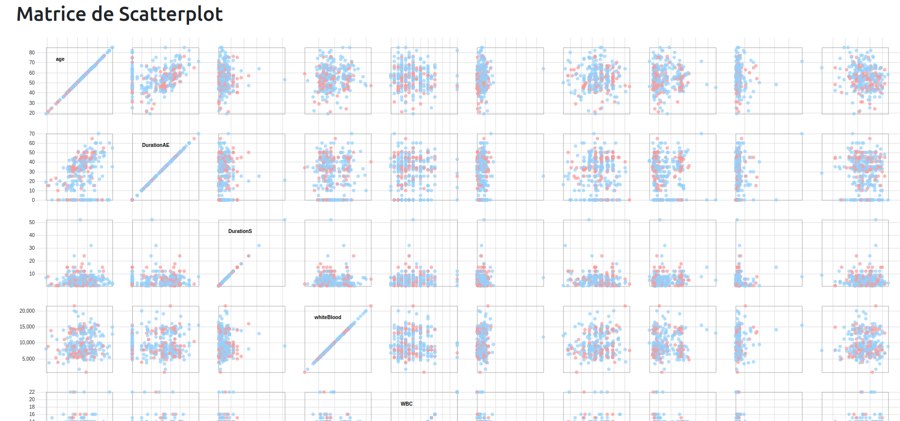
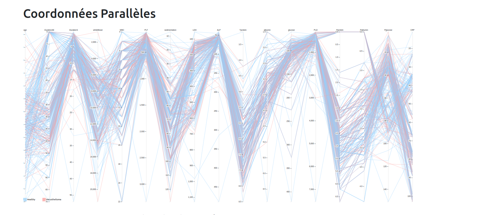
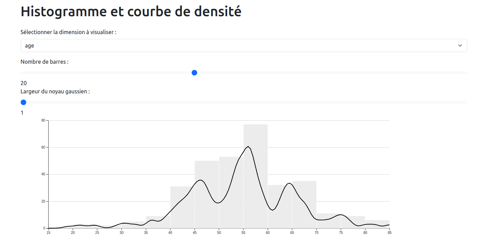

# DataVisu

This project showcases synchronized data visualizations using different types with D3.js.

## Features

- **Scatterplot Matrix**: Visualizes pairwise relationships between multiple variables.
  

- **Parallel Coordinates**: Displays multi-dimensional data by drawing a line for each data point across multiple parallel axes.
  

- **Histogram and Density Curve**: Allows you to select a specific dimension to visualize, adjust the number of bars, or modify the Gaussian kernel width for the density curve.
  

## Usage

1. **Scatterplot Matrix**: Interact with the scatterplot matrix to explore relationships between different pairs of variables. Selected data points are highlighted across all visualizations.

2. **Parallel Coordinates**: Use the parallel coordinates plot to see how data points compare across multiple dimensions. Selections made here are reflected in the scatterplot matrix and histogram.

3. **Histogram and Density Curve**: Customize the histogram by selecting the dimension, adjusting the number of bars, or modifying the Gaussian kernel width for the density curve. Selections are synchronized with the other visualizations.

## Synchronization

Selections in any of the graphs are synchronized, ensuring that when you select data points in one graph, the corresponding points are highlighted in the other graphs.

## Data

The dataset used in this project can be found in `data.js`. It is a sample representing diagnostic tests for Mesothelioma.
